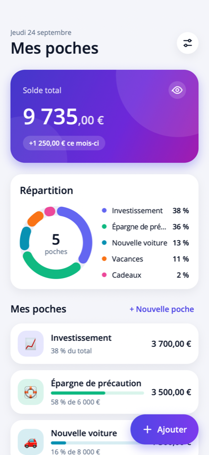
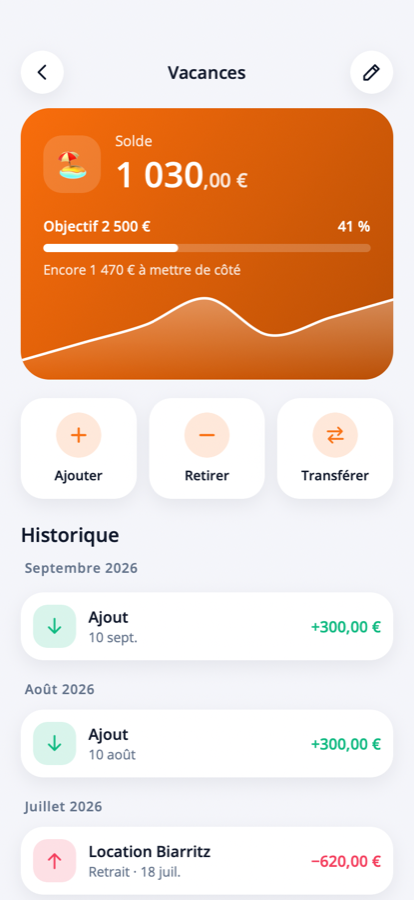
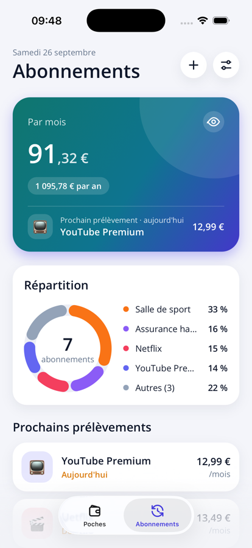
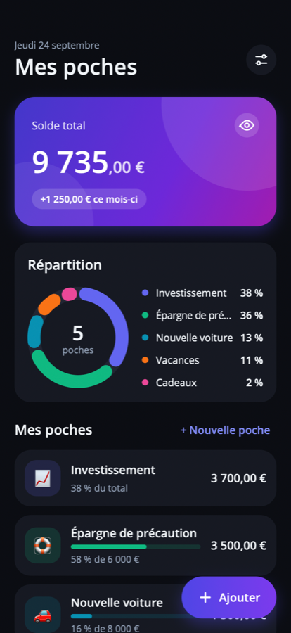
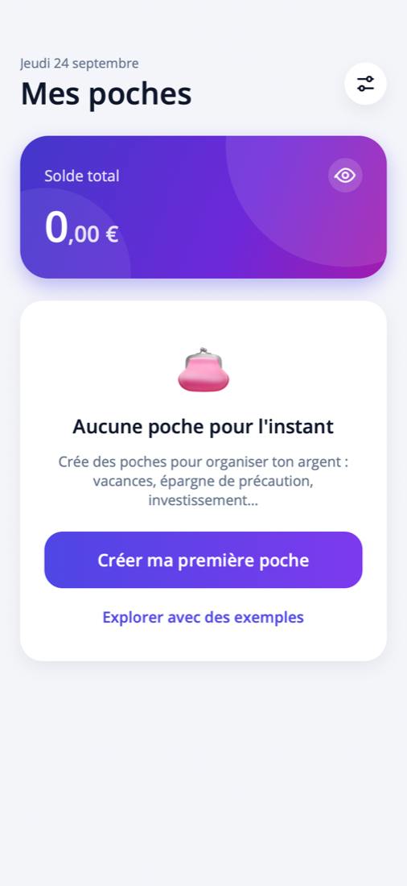

# Poches

Application mobile de budget par « poches » (vacances, épargne, investissement…), en **.NET MAUI 10** pour **iPhone et Android**.

| Accueil | Détail d'une poche | Abonnements | Mode sombre | Premier lancement |
|---|---|---|---|---|
|  |  |  |  |  |

## Fonctionnalités

- **Accueil** : solde total (centimes en plus petit), variation du mois, graphique en anneau de la répartition, liste des poches avec montant, part du total ou progression vers l'objectif.
- **Poches** : nom, emoji, couleur, objectif d'épargne facultatif, montant de départ.
- **Mouvements** : ajout, retrait, **transfert entre poches**, note et date, avec un pavé numérique intégré. Un retrait ne peut pas dépasser le solde.
- **Détail d'une poche** : courbe d'évolution du solde, barre de progression vers l'objectif, historique groupé par mois (appui sur une ligne pour la supprimer).
- **Abonnements** (second onglet) : Netflix, salle de sport, assurances… avec leur prix et leur fréquence (semaine, mois, trimestre, année). Coût total par mois et par an, prochain prélèvement, répartition en anneau, liste triée par échéance (en orange quand c'est dans moins de 3 jours), abonnements en pause ou résiliés à part.
- **Rappels** : une notification à 9 h la veille de chaque prélèvement (ou le jour même, 3 jours ou une semaine avant, réglable dans les réglages). Les rappels des prochaines échéances sont replanifiés à chaque ouverture de l'app.
- **Mode discret** (icône œil) : masque tous les montants, utile en public.
- **Langues** : français, néerlandais et anglais, au choix dans les réglages (par défaut : la langue du téléphone). Le changement est immédiat, et les montants et dates suivent les conventions de la langue (« 1 234,56 € », « € 1.234,56 », « €1,234.56 »).
- **Réglages** (bouton en haut à droite) : langue, devise d'affichage (€, CHF, $, £), mode discret, sauvegarde, restauration et « Tout effacer ».
- **Sauvegarde / restauration** : exporte toutes les poches dans un fichier **chiffré par un mot de passe** choisi à chaque sauvegarde, via la feuille de partage (iCloud Drive, mail, AirDrop…), et le restaure sur n'importe quel téléphone, iPhone ou Android. Un rappel apparaît sur l'accueil si la dernière sauvegarde date de plus de 30 jours.
- **Verrouillage Face ID / Touch ID** (iPhone et Mac, option dans Réglages › Sécurité) : demandé à l'ouverture et à chaque retour dans l'app, avec le code de l'appareil (ou le mot de passe du Mac) en secours. L'écran de verrouillage recouvre tout, y compris l'aperçu dans le sélecteur d'apps. Pas encore disponible sur Android.
- **Thème clair / sombre** automatique.
- **Exemples** : sur l'écran vide, « Explorer avec des exemples » crée 5 poches de démonstration.

## Persistance

**SQLite** local via `sqlite-net-pcl`, dans le dossier privé de l'app. Aucune connexion réseau n'est demandée (pas de permission INTERNET sur Android).

- Les montants sont stockés en **centimes (`long`)** pour éviter les erreurs d'arrondi.
- Le solde d'une poche n'est **jamais stocké** : c'est toujours la somme de ses mouvements, il ne peut donc pas se désynchroniser.
- Un transfert crée deux mouvements liés, supprimés ensemble.
- La sauvegarde est un fichier JSON versionné (`format: "poches-backup"`, version 2 depuis l'ajout des abonnements), indépendant du schéma SQLite. La restauration est atomique : un fichier incohérent est refusé sans toucher aux données. Une sauvegarde de version 1 ne touche pas aux abonnements existants.
- Le fichier écrit est une enveloppe JSON (`format: "poches-backup-encrypted"`) : clé dérivée du mot de passe par PBKDF2-HMAC-SHA256 (600 000 itérations, sel aléatoire de 16 octets, mot de passe normalisé en Unicode NFC), puis AES-256-GCM (nonce de 12 octets, tag de 16 octets) sur le JSON ci-dessus. Le tag détecte un mauvais mot de passe comme un fichier modifié. Le mot de passe n'est stocké nulle part : perdu, la sauvegarde est irrécupérable. Les anciennes sauvegardes non chiffrées restent restaurables.
- Un abonnement stocke une date de référence et une fréquence : les échéances sont recalculées à partir de cette date (un prélèvement le 31 revient au 31 après février).

## Architecture

```
Poches.slnx
├── src/Poches.Core          net10.0 — modèles, BudgetStore (SQLite), échéances des abonnements, formatage des montants
├── src/Poches               app .NET MAUI (MVVM avec CommunityToolkit.Mvvm)
│   ├── Views/               pages XAML (bindings compilés)
│   ├── ViewModels/          un ViewModel par page
│   ├── Controls/            dessin vectoriel maison : anneau, courbe, barre de progression, icônes
│   ├── Services/            réglages, dialogues, sauvegarde, rappels (Plugin.LocalNotification), palette, routes
│   └── Resources/Styles/    couleurs et styles (clair/sombre)
└── tests/Poches.Core.Tests  tests xUnit de la logique métier (SQLite réel en fichier temporaire)
```

### Traductions

Les textes sont dans `src/Poches/Resources/Strings/` : `AppResources.resx` (anglais, langue par défaut), `AppResources.fr.resx` et `AppResources.nl.resx` (l'éditeur de ressources de Rider les affiche côte à côte).
- En XAML : `Text="{l:Tr Main_Title}"` ; en C# : `Loc.Get("Main_Title")` ou `Loc.Format("Main_ThisMonth", montant)`.
- Les erreurs métier de `Poches.Core` sont des codes (`BudgetError`) traduits via les clés `Error_*`.
- Les tests `TranslationTests` échouent si une langue n'a pas les mêmes clés ou les mêmes `{0}`, si une clé utilisée dans le code n'existe pas, ou si une clé n'est plus utilisée.
- Pour ajouter une langue : créer `AppResources.xx.resx`, l'ajouter à `Localizer.Languages` et à `CFBundleLocalizations` (Info.plist iOS).

Les graphiques et icônes sont dessinés avec `Microsoft.Maui.Graphics` : aucune bibliothèque de graphiques tierce, rendu identique sur iOS et Android.

## Lancer l'app

Prérequis communs : SDK .NET 10 et workload MAUI (`dotnet workload install maui`).

### iPhone (simulateur ou appareil)

1. Dans Xcode, installer la plateforme iOS : **Xcode › Settings › Components › iOS**.
2. Faire pointer les outils en ligne de commande vers Xcode (une seule fois) :
   ```bash
   sudo xcode-select -s /Applications/Xcode.app
   ```
3. Lancer depuis Rider (cible `net10.0-ios`) ou :
   ```bash
   dotnet build src/Poches -t:Run -f net10.0-ios
   ```
   Sur un vrai iPhone, un compte Apple Developer est nécessaire pour signer l'app.

### Android

1. Installer le SDK Android et un JDK 21 (le plus simple : via Android Studio, ou Rider › Settings › Environment › Android).
2. Démarrer un émulateur ou brancher un téléphone, puis lancer depuis Rider (cible `net10.0-android`) ou :
   ```bash
   dotnet build src/Poches -t:Run -f net10.0-android
   ```

### Mac (Mac Catalyst)

La même app tourne sur Mac, adaptée au bureau :

- fenêtre de 560 × 820 points à l'ouverture (taille mémorisée si tu la changes), contenu en colonne centrée quand la fenêtre est large ;
- les feuilles (réglages, ajout, poche, abonnement, mot de passe) s'affichent en carte centrée sur fond assombri : sur Mac, MAUI 10 ne termine jamais la navigation vers une vraie *PageSheet*, ce qui bloquerait l'app ;
- clavier : `Échap` ferme la feuille ouverte ; dans « Ajouter », le montant se tape au clavier (chiffres, `,` ou `.`, `⌫`, `Entrée` pour valider) ;
- la sauvegarde s'enregistre via le panneau « Enregistrer » du Mac au lieu de la feuille de partage ;
- survol des éléments cliquables à la souris, onglet sélectionné aux couleurs de l'app.

Les données du Mac sont séparées de celles du téléphone : pour passer de l'un à l'autre, faire une sauvegarde (chiffrée) dans iCloud Drive puis la restaurer de l'autre côté.

Lancer depuis les sources :

```bash
dotnet build src/Poches -t:Run -f net10.0-maccatalyst
```

Installer dans Applications (signature ad hoc, pour ce Mac uniquement, sans expiration) :

```bash
dotnet build src/Poches -f net10.0-maccatalyst -c Release -r maccatalyst-arm64 && ditto src/Poches/bin/Release/net10.0-maccatalyst/maccatalyst-arm64/Poches.app /Applications/Poches.app
```

### Tests

```bash
dotnet test tests/Poches.Core.Tests
```

## Idées pour la suite

- Virements récurrents automatiques vers une poche (ex. +200 € chaque mois sur « Épargne »).
- Verrouillage par Face ID / empreinte.
- Synchronisation automatique entre appareils (CloudKit, nécessite un compte Apple Developer payant).
- Lier un abonnement à une poche pour débiter automatiquement chaque prélèvement.
- Suivi de la valeur des investissements (plus-values) en plus des versements.
- Statistiques mensuelles (entrées/sorties par mois) et date cible pour les objectifs.
- Widget d'écran d'accueil avec le solde total.
